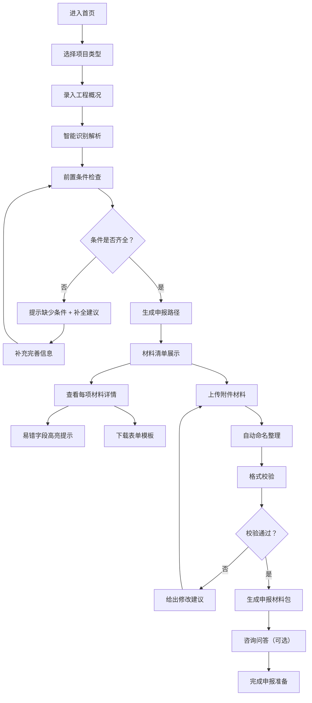
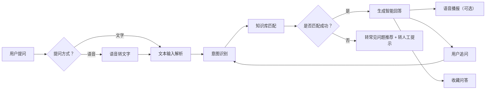

## 1. 产品概述

智能联合验收申报助手是一款面向建设单位和代办机构的智能化申报辅助工具，围绕联合验收中最容易卡住的材料填写和政策理解环节提供全流程引导。通过智能路径生成、自然语言解释、易错字段高亮等功能，帮助不会填、怕填错的办事人把申报一次做对。

- **目标用户**：建设单位项目经办人、代办机构申报人员
- **核心价值**：降低申报门槛、减少补正次数、提高验收通过率
- **产品定位**："一对一"的智能申报顾问，让复杂的验收申报变简单

## 2. 核心功能

### 2.1 用户角色

| 角色 | 注册方式 | 核心权限 |
|------|---------|---------|
| 建设单位用户 | 手机号注册 | 项目管理、材料申报、智能咨询 |
| 代办机构用户 | 手机号注册+机构认证 | 多项目管理、批量申报、模板共享 |
| 管理员 | 后台账号 | 政策维护、问答库管理、数据统计 |

### 2.2 功能模块

1. **首页仪表盘**：快捷入口、申报进度、政策提醒、常见问题
2. **智能申报路径**：项目类型选择、自动生成申报步骤、进度追踪
3. **材料清单向导**：材料列表、自然语言解释、易错字段高亮、模板下载
4. **工程概况识别**：智能解析工程信息、自动填充表单、前置条件检查
5. **附件智能管理**：附件上传、自动命名整理、格式校验
6. **补正说明生成**：智能生成补正意见、一键导出补正说明
7. **智能问答中心**：验收顺序咨询、办理时限查询、语音咨询
8. **知识库管理**：常见问答保存、政策变更推送、收藏夹

### 2.3 页面详情

| 页面名称 | 模块名称 | 功能描述 |
|---------|---------|---------|
| 首页仪表盘 | 快捷操作区 | 新建申报、继续申报、政策速递入口 |
| 首页仪表盘 | 申报进度卡 | 当前项目进度、待办事项、补正提醒 |
| 首页仪表盘 | 政策变更提醒 | 最新政策推送、重要变更高亮 |
| 首页仪表盘 | 常见问题 | 热门问答快速入口 |
| 申报路径页 | 项目类型选择 | 房建/市政/装修等类型选择，项目信息录入 |
| 申报路径页 | 路径时间轴 | 可视化申报步骤、当前进度、完成状态 |
| 申报路径页 | 步骤详情 | 每步的材料要求、办理时限、注意事项 |
| 材料清单页 | 材料分类列表 | 按类别分组的材料清单、必选/可选标识 |
| 材料清单页 | 材料详情卡片 | 自然语言解释要求、示例说明、易错点提示 |
| 材料清单页 | 易错字段高亮 | 高频出错字段红色边框+提示气泡 |
| 材料清单页 | 模板推荐下载 | 常用表单模板推荐、一键下载 |
| 工程概况页 | 信息录入表单 | 工程基本信息录入、智能联想输入 |
| 工程概况页 | 智能识别解析 | 粘贴/上传工程概况文档，自动提取关键信息 |
| 工程概况页 | 前置条件检查 | 自动检测缺少的前置条件、给出补全建议 |
| 附件管理页 | 附件上传区 | 拖拽上传、批量上传、格式校验 |
| 附件管理页 | 智能命名整理 | 按照规范自动重命名、批量整理 |
| 附件管理页 | 附件清单 | 已上传附件列表、预览、删除、重命名 |
| 补正说明页 | 补正问题录入 | 录入审批意见、勾选存在问题 |
| 补正说明页 | 智能生成说明 | 根据问题自动生成规范的补正说明 |
| 补正说明页 | 导出与打印 | 一键导出Word/PDF格式补正说明 |
| 问答中心页 | 问题分类导航 | 验收顺序、办理时限、材料要求、其他 |
| 问答中心页 | 对话式问答 | 自然语言提问、智能回答、追问 |
| 问答中心页 | 语音咨询 | 语音输入提问、语音播报回答 |
| 问答中心页 | 收藏与历史 | 常见问题收藏、历史问答记录 |
| 我的收藏页 | 问答收藏夹 | 收藏的问答列表、分类管理 |
| 我的收藏页 | 政策订阅 | 政策分类订阅、推送设置 |

## 3. 核心流程

### 3.1 智能申报主流程

用户从首页开始，选择项目类型后，系统自动生成申报路径。用户按照步骤逐步准备材料，过程中可以随时咨询问题、查看模板、检查前置条件。所有材料准备完成后，系统生成规范的申报材料包和补正说明。

### 3.2 智能问答流程

用户可以通过文字或语音提问，系统根据问题类型匹配最佳回答，支持多轮对话和追问。

## 4. 用户界面设计

### 4.1 设计风格

- **主色调**：政务蓝（#1e40af）作为主色，代表专业、可信
- **辅助色**：警示橙（#f97316）用于易错字段和重要提醒
- **成功色**：翠绿（#10b981）用于完成状态和通过提示
- **字体**：标题使用思源黑体 Bold，正文使用思源黑体 Regular，数字等宽字体
- **按钮风格**：圆角8px，悬停有微缩放和阴影变化
- **布局风格**：左侧导航 + 右侧内容区，卡片式布局
- **图标风格**：线性图标，统一2px描边，配色与主题一致
- **整体气质**：专业、清晰、温暖，降低办事人的焦虑感

### 4.2 页面设计概述

| 页面名称 | 模块名称 | UI元素 |
|---------|---------|-------|
| 首页仪表盘 | 快捷操作区 | 大号卡片、渐变背景、图标+文字、悬停上浮 |
| 首页仪表盘 | 进度追踪卡 | 环形进度图、状态标签、待办徽标 |
| 首页仪表盘 | 政策提醒区 | 时间线布局、新政策红点提示、重要项橙色高亮 |
| 申报路径页 | 步骤时间轴 | 垂直时间轴、圆形步骤节点、连接线动画、当前步骤呼吸效果 |
| 申报路径页 | 步骤详情卡 | 卡片展开收起、材料数量徽标、时限标签 |
| 材料清单页 | 材料卡片 | 左右布局，左侧图标名称，右侧状态和操作 |
| 材料清单页 | 易错字段 | 红色渐变边框、感叹号图标、悬停显示提示气泡 |
| 材料清单页 | 解释说明 | 折叠面板、大白话解释、示例展示 |
| 工程概况页 | 表单区域 | 分组表单、智能联想下拉、自动填充动效 |
| 工程概况页 | 智能识别区 | 虚线边框上传区、解析进度条、识别结果高亮 |
| 附件管理页 | 上传区 | 拖拽区域、文件图标、上传进度条 |
| 附件管理页 | 文件列表 | 表格布局、自动命名标签、格式状态 |
| 问答中心页 | 对话区域 | 聊天气泡布局、打字机动画、快捷问题标签 |
| 问答中心页 | 语音按钮 | 圆形麦克风按钮、录音时脉冲动画 |

### 4.3 响应式

- **桌面优先**设计，适配1366px及以上屏幕
- **平板适配**：左侧导航收起为图标模式，内容区自适应
- **手机适配**：底部导航栏，卡片纵向堆叠，表单全宽展示
- **触控优化**：点击区域不小于44px，重要操作按钮放大

### 4.4 动效与交互

- **页面切换**：淡入 + 轻微上移动画
- **卡片悬停**：上浮4px + 阴影加深
- **进度变化**：平滑过渡动画
- **易错提示**：首次进入时脉冲闪烁吸引注意
- **问答回复**：打字机效果逐字显示
- **语音交互**：录音时波形动画
