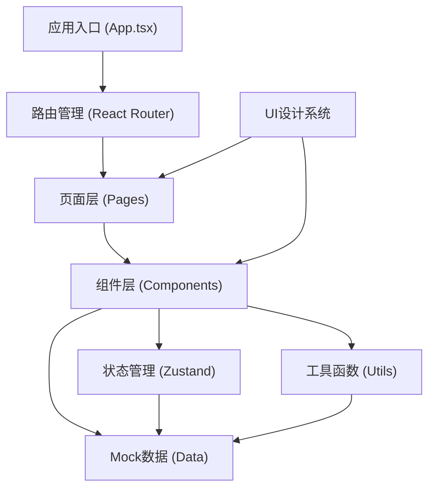

## 1. 架构设计

本项目为纯前端应用，使用 React + TypeScript + Vite + Tailwind CSS 技术栈。采用组件化架构设计，状态管理使用 Zustand，数据使用 Mock 数据模拟。



## 2. 技术描述

- **前端框架**：React@18 + TypeScript@5
- **构建工具**：Vite@5
- **样式方案**：Tailwind CSS@3
- **状态管理**：Zustand@4
- **路由管理**：React Router DOM@6
- **图标库**：Lucide React
- **数据模拟**：前端 Mock 数据
- **语音功能**：Web Speech API

## 3. 路由定义

| 路由 | 页面名称 | 说明 |
|------|---------|------|
| / | 首页仪表盘 | 快捷入口、申报进度、政策提醒 |
| /declaration-path | 申报路径 | 项目类型选择、申报步骤时间轴 |
| /materials | 材料清单 | 材料列表、自然语言解释、易错字段 |
| /project-overview | 工程概况 | 信息录入、智能识别、前置条件检查 |
| /attachments | 附件管理 | 附件上传、自动命名、格式校验 |
| /correction | 补正说明 | 问题录入、智能生成、导出 |
| /qa | 问答中心 | 智能问答、语音咨询 |
| /favorites | 我的收藏 | 问答收藏、政策订阅 |

## 4. 数据模型

### 4.1 项目类型定义

```typescript
interface ProjectType {
  id: string;
  name: string;
  icon: string;
  description: string;
  categories: string[];
}
```

### 4.2 申报步骤定义

```typescript
interface DeclarationStep {
  id: string;
  stepNumber: number;
  title: string;
  description: string;
  timeLimit: string;
  status: 'pending' | 'current' | 'completed';
  materials: MaterialItem[];
}
```

### 4.3 材料项定义

```typescript
interface MaterialItem {
  id: string;
  name: string;
  category: string;
  required: boolean;
  description: string;
  plainExplanation: string;
  example: string;
  errorProneFields: ErrorProneField[];
  templates: TemplateItem[];
  status: 'not-started' | 'in-progress' | 'completed';
}
```

### 4.4 易错字段定义

```typescript
interface ErrorProneField {
  id: string;
  fieldName: string;
  errorTip: string;
  correctExample: string;
  errorRate: number;
}
```

### 4.5 问答对定义

```typescript
interface QaItem {
  id: string;
  question: string;
  answer: string;
  category: string;
  tags: string[];
  isFavorite: boolean;
  viewCount: number;
}
```

### 4.6 政策更新定义

```typescript
interface PolicyUpdate {
  id: string;
  title: string;
  content: string;
  publishDate: string;
  level: 'normal' | 'important' | 'urgent';
  isRead: boolean;
}
```

## 5. 状态管理设计

### 5.1 项目状态 Store

```typescript
interface ProjectState {
  currentProject: ProjectInfo | null;
  projectTypes: ProjectType[];
  declarationSteps: DeclarationStep[];
  setCurrentProject: (project: ProjectInfo) => void;
  updateStepStatus: (stepId: string, status: StepStatus) => void;
}
```

### 5.2 材料状态 Store

```typescript
interface MaterialState {
  materials: MaterialItem[];
  selectedCategory: string;
  setMaterials: (materials: MaterialItem[]) => void;
  toggleMaterialStatus: (id: string) => void;
}
```

### 5.3 问答状态 Store

```typescript
interface QaState {
  chatHistory: ChatMessage[];
  favorites: QaItem[];
  isRecording: boolean;
  addMessage: (msg: ChatMessage) => void;
  toggleFavorite: (id: string) => void;
  setRecording: (val: boolean) => void;
}
```

## 6. 目录结构

```
src/
├── components/          # 可复用组件
│   ├── layout/         # 布局组件（侧边栏、顶部栏）
│   ├── common/         # 通用组件（按钮、卡片、模态框）
│   └── business/       # 业务组件（材料卡片、问答气泡等）
├── pages/              # 页面组件
│   ├── Dashboard/
│   ├── DeclarationPath/
│   ├── Materials/
│   ├── ProjectOverview/
│   ├── Attachments/
│   ├── Correction/
│   ├── QaCenter/
│   └── Favorites/
├── store/              # Zustand 状态管理
│   ├── projectStore.ts
│   ├── materialStore.ts
│   └── qaStore.ts
├── data/               # Mock 数据
│   ├── projectTypes.ts
│   ├── materials.ts
│   ├── qaData.ts
│   └── policies.ts
├── utils/              # 工具函数
│   ├── speech.ts       # 语音相关
│   ├── format.ts       # 格式化
│   └── validator.ts    # 校验函数
├── types/              # TypeScript 类型定义
│   └── index.ts
├── App.tsx
├── main.tsx
└── index.css
```

## 7. 核心功能实现思路

### 7.1 智能申报路径生成
- 根据选择的项目类型匹配预设的申报流程模板
- 每个步骤包含材料清单、办理时限、注意事项
- 使用时间轴组件可视化展示进度

### 7.2 易错字段高亮
- 预设高频出错字段及其错误率
- 表单中对应字段添加红色渐变边框和警示图标
- 悬停显示详细错误提示和正确示例
- 首次进入页面时有脉冲动画吸引注意

### 7.3 工程概况智能识别
- 预设关键词提取规则
- 模拟从文本中提取项目名称、地址、面积、层数等信息
- 自动填充到表单对应字段
- 高亮显示识别结果供用户确认修改

### 7.4 附件自动命名
- 预设命名规范：[项目名称]-[材料类别]-[材料名称]-[版本号]
- 上传后自动按照规范重命名
- 支持批量重命名和手动调整

### 7.5 智能问答
- 预设常见问题和答案库
- 基于关键词匹配和相似度计算返回最佳答案
- 支持多轮对话和追问
- 使用 Web Speech API 实现语音输入和语音播报

### 7.6 补正说明生成
- 预设补正问题模板
- 用户勾选存在的问题后，自动生成规范的补正说明
- 支持编辑和导出

## 8. 视觉与动效实现

- **CSS 变量**：定义主题色、间距、字体层级
- **Tailwind 配置**：扩展自定义颜色、字体、动画
- **过渡动画**：使用 CSS transition 和 transform
- **关键帧动画**：脉冲、呼吸、打字机等效果
- **微交互**：悬停、点击、状态切换的细节动效
